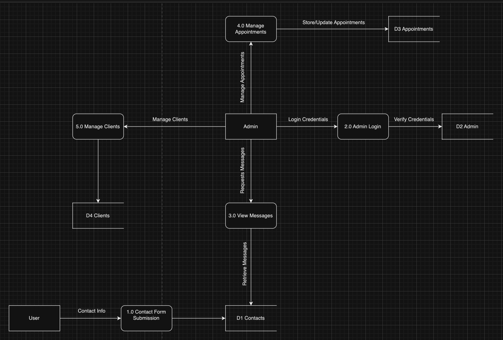

# ExPhys Clinic

## Purpose
The ExPhys Clinic website aims to provide comprehensive information about the clinical exercise physiology services offered, facilitate easy communication between potential clients and the clinic, and offer an administrative dashboard for managing client interactions and appointments.

## Functionality / Features
### Homepage
- **Overview of the Clinic:** Information about the clinic and its services.
- **Meet Our Expert:** Introduction to Angeli Milne, Clinical Exercise Physiologist.
- **Our Services:** Detailed information on services such as Home Visits, 1:1 Gym Sessions, Hydrotherapy, and Telehealth.
- **Contact Form:** A form for potential clients to get in touch with the clinic.

### Admin Login Page
- **Secure Login:** Allows administrators to log in securely to access the admin dashboard.

### Admin Dashboard
- **Overview of Appointments:** View and manage appointments, with statuses such as Active, Upcoming, and Completed.
- **Clients Management:** View and manage client details, including name, DOB, contact number, and GP.
- **Inbox:** View and respond to messages received through the contact form. Includes a detailed view for each message with actions to mark as read, respond, or delete.

## Target Audience
- **Potential Clients:** Individuals seeking exercise physiology services.
- **Current Clients:** Existing clients needing to update their information or get in touch with the clinic.
- **Clinic Administrators:** Admins managing client interactions, appointments, and inquiries.

## Tech Stack
### Frontend
- **React.js:** For building the user interface and handling client-side interactions.
- **CSS/HTML:** For styling and structuring the web pages.
- **Axios:** For making HTTP requests to the backend.

### Backend
- **Node.js:** For server-side scripting.
- **Express.js:** For building the RESTful APIs.

### Database
- **MongoDB:** For storing client information, appointments, and messages.

### Authentication
- **JWT (JSON Web Tokens):** For secure authentication of admin users.

### Development Tools
- **Figma:** For designing the wireframes.
- **Draw.io:** For creating diagrams such as data flow diagrams and application architecture diagrams.
- **VS Code:** As the code editor.
- **GitHub:** For version control and collaboration.

## Dataflow Diagram

## Application Architecture Diagram

## User Stories

#### User Story 1:
**Persona:** Sarah, a new client  
**What:** Register for an account  
**Why:** So she can access the services and track her progress

**Refined Version:**
"As Sarah, a new client, I want to register for an account easily, with minimal steps and clear instructions, so that I can quickly access the services and start tracking my fitness progress."

---

#### User Story 2:
**Persona:** Dr. James, an exercise physiologist  
**What:** View client profiles  
**Why:** To understand their health history and create personalized plans

**Refined Version:**
"As Dr. James, an exercise physiologist, I want to access comprehensive client profiles that include detailed health histories and personal information, so that I can develop tailored exercise plans for each client."

---

#### User Story 3:
**Persona:** Emily, a returning client  
**What:** Log in to her account  
**Why:** To check her progress history and update her profile

**Refined Version:**
"As Emily, a returning client, I want to quickly log in to my account with secure authentication, so that I can review my past progress records and update my profile as needed."

---

#### User Story 4:
**Persona:** Dr. John, an admin  
**What:** Manage client profiles  
**Why:** To ensure all client information is up-to-date and accurate

**Refined Version:**
"As Dr. John, an admin, I want to have a clear and intuitive interface for managing client profiles, so that I can ensure all client information is up-to-date and accurate."

---

#### User Story 5:
**Persona:** Anna, a client  
**What:** Update her profile information  
**Why:** To keep her health data current and accurate

**Refined Version:**
"As Anna, a client, I want to easily update my profile information through a user-friendly interface, so that my health data remains current and accurate for better personalized care."

---

#### User Story 6:
**Persona:** Dr. Lisa, an exercise physiologist  
**What:** Access the admin dashboard  
**Why:** To view business metrics and client activity

**Refined Version:**
"As Dr. Lisa, an exercise physiologist, I want to access a comprehensive admin dashboard that provides real-time business metrics and detailed client activity, so that I can make informed decisions and improve service efficiency."

