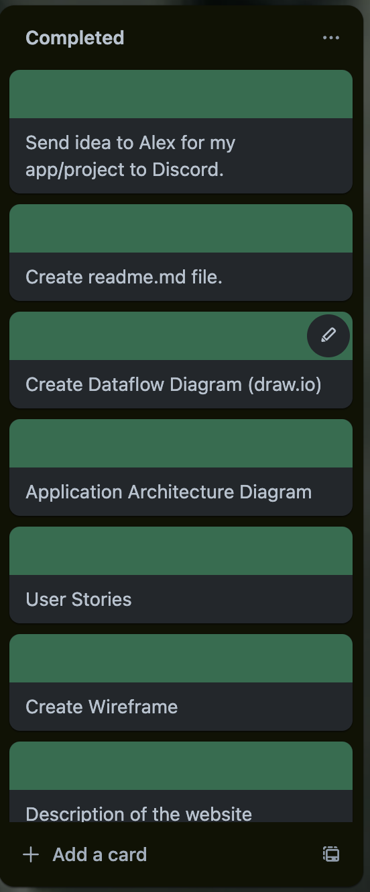

# ExPhys Clinic MERN APP

## Developer - Ezekiel Milne

### Links

[Github](https://github.com/codzk/ExPhysMERNapp)
[Figma](https://www.figma.com/design/ycf5iJoNmEqWKPMvX6V06C/Untitled?node-id=0-1&t=gFlNY7CBl87KXBMZ-1)
[Trello](https://trello.com/b/RMYrKqlC/exphys-mern-app)

## Purpose
The ExPhys Clinic website aims to provide comprehensive information about the clinical exercise physiology services offered, facilitate easy communication between potential clients and the clinic, and offer an administrative dashboard for managing client interactions and appointments.

## Functionality / Features
### Homepage
- **Overview of the Clinic:** Information about the clinic and its services.
- **Meet Our Expert:** Introduction to Angeli Milne, Clinical Exercise Physiologist.
- **Our Services:** Detailed information on services such as Home Visits, 1:1 Gym Sessions, Hydrotherapy, and Telehealth.
- **Contact Form:** A form for potential clients to get in touch with the clinic.

### Admin Login Page
- **Secure Login:** Allows administrators to log in securely to access the admin dashboard.

### Admin Dashboard
- **Overview of Appointments:** View and manage appointments, with statuses such as Active, Upcoming, and Completed.
- **Clients Management:** View and manage client details, including name, DOB, contact number, and GP.
- **Inbox:** View and respond to messages received through the contact form. Includes a detailed view for each message with actions to mark as read, respond, or delete.

## Target Audience
- **Potential Clients:** Individuals seeking exercise physiology services.
- **Current Clients:** Existing clients needing to update their information or get in touch with the clinic.
- **Clinic Administrators:** Admins managing client interactions, appointments, and inquiries.

## Tech Stack
### Frontend
- **React.js:** For building the user interface and handling client-side interactions.
- **CSS/HTML:** For styling and structuring the web pages.
- **Axios:** For making HTTP requests to the backend.

### Backend
- **Node.js:** For server-side scripting.
- **Express.js:** For building the RESTful APIs.

### Database
- **MongoDB:** For storing client information, appointments, and messages.

### Authentication
- **JWT (JSON Web Tokens):** For secure authentication of admin users.

### Development Tools
- **Figma:** For designing the wireframes.
- **Draw.io:** For creating diagrams such as data flow diagrams and application architecture diagrams.
- **VS Code:** As the code editor.
- **GitHub:** For version control and collaboration.

## Dataflow Diagram

## Application Architecture Diagram

# User Stories

## User Story 1
**Persona:** Sarah, a new client  
**What:** Access information about the clinic and exercise physiology  
**Why:** To understand the services offered and how they can benefit her health and fitness

**Refined Version:**
"As Sarah, a new client, I want to easily access detailed information about ExPhys Clinic and exercise physiology so that I can understand the services offered and how they can benefit my health and fitness."

---

## User Story 2
**Persona:** Dr. James, an exercise physiologist  
**What:** View client inquiries from the contact form  
**Why:** To respond to potential clients and manage their questions and concerns

**Refined Version:**
"As Dr. James, an exercise physiologist, I want to view client inquiries submitted through the 'Get in Touch' contact form so that I can respond promptly and manage their questions and concerns effectively."

---

## User Story 3
**Persona:** Emily, a returning client  
**What:** View detailed information about the services offered  
**Why:** To decide which service (e.g., Home Visit, 1:1 Gym Session, Hydrotherapy, Telehealth) is best suited for her current needs

**Refined Version:**
"As Emily, a returning client, I want to view detailed information about the services offered by ExPhys Clinic so that I can decide which service is best suited for my current needs."

---

## User Story 4
**Persona:** Dr. John, an admin  
**What:** Manage contact submissions from the admin dashboard  
**Why:** To ensure all client inquiries are addressed and followed up on

**Refined Version:**
"As Dr. John, an admin, I want to manage contact submissions through the admin dashboard so that I can ensure all client inquiries are addressed and followed up on in a timely manner."

---

## User Story 5
**Persona:** Anna, a potential client  
**What:** Access the "Meet Our Expert" section  
**Why:** To learn more about the qualifications and experience of Angeli Milne, the Clinical Exercise Physiologist

**Refined Version:**
"As Anna, a potential client, I want to access the 'Meet Our Expert' section easily so that I can learn more about the qualifications and experience of Angeli Milne, the Clinical Exercise Physiologist."

---

## User Story 6
**Persona:** Dr. Lisa, an exercise physiologist  
**What:** View the admin dashboard  
**Why:** To see an overview of business metrics and client inquiries

**Refined Version:**
"As Dr. Lisa, an exercise physiologist, I want to access a comprehensive admin dashboard that provides an overview of business metrics and client inquiries so that I can make informed decisions and improve service efficiency."

---

## User Story 7
**Persona:** Michael, a prospective client with a busy schedule  
**What:** Contact the clinic outside of business hours  
**Why:** To ensure he can reach out and get information even when the clinic is closed

**Refined Version:**
"As Michael, a prospective client with a busy schedule, I want to be able to contact the clinic outside of business hours so that I can get information and inquire about services at a convenient time for me."

---

## User Story 8
**Persona:** Jessica, an admin  
**What:** Update and manage appointments in the admin dashboard  
**Why:** To ensure all client appointments are organized and up to date

**Refined Version:**
"As Jessica, an admin, I want to update and manage appointments in the admin dashboard so that I can ensure all client appointments are organized and up to date."

# Wireframes

# Screenshots (Trello)

 
 

